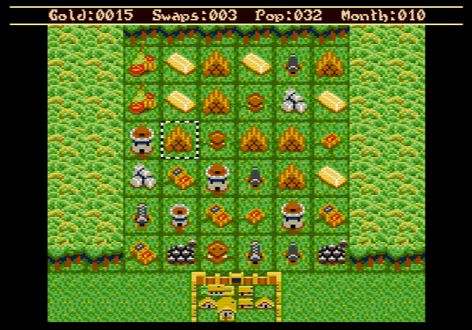

Outpost in the Dragon's Maw
==============================================================================

:Author:    Sandor Zsuga (Jubatian)
:License:   GNU GPLv3 (version 3 of the GNU General Public License)

Overview
------------------------------------------------------------------------------

Outpost in the Dragon's Maw is a combination of Match-3 and Tower Defense for
the Uzebox console (http://www.uzebox.org).

After the discovery of a lush new continent, you are tasked with establishing
the first settlement on its shores to exploit its riches. This all goes well
until mysterious disappearances start to surface along with uncertain sighting
of large flying creatures...

This game is still in Work In Progress, however the main gameplay should be
largely complete and hopefully enjoyable as a proper game.

Requirements
------------------------------------------------------------------------------

For playing the game you either need an Uzebox (or build something compatible
using an ATMega644p), see http://www.uzebox.org, or use an emulator such as
CUzebox or Uzem. For peripherals you need an SNES controller only (no SD card
is required).

Game binaries are provided (a .hex and a .uze file, the former can be burned
in the ATMega directly, the latter can be used with Uzeboxes with an SD card
slot and a bootloader) in the _bin_ folder, so you don't necessarily need to
compile if you just want to play it.

Controls
------------------------------------------------------------------------------

You can navigate the cursor with the D-Pad (or arrow keys in emulators).

Selections can be made or cleared with Select, Y or B (the CUzebox emulator
maps Select to Space on the keyboard).

Switching between menus (to end turn early or spend gold) can be made with any
other button on the controller (with the CUzebox emulator convenient keys on
the keyboard could be Shift keys or Enter).

How to play the game
------------------------------------------------------------------------------

The goal is building up your defenses to guard your settlement against the
ever increasing onslaught of dragons by matching items on the playfield. Move
at least three of them adjacent in a row or column to make a match.

- Stone towers are able to shoot at dragons in their close proximity (adjacent
  tiles including diagonals).
- Wooden ballista towers are able to shoot diagonally to any distance. They
  are unable to shoot directly above them.
- Cannons shoot explosive cannonballs forward which deal splash damage
  covering nine tiles.
- Markets buff the four directly adjacent tiles, so towers or cannons there
  deal more damage. Their bonus if multiple markets are adjacent to a tile
  doesn't stack.
- Gold gives you money to spend on expanding the settlement or to get more
  work done in a month.

The options in the Gold menu:

- End: Ends the month early. Up to a month's worth of swaps can be carried
  over to the next month if using this option.
- Pop: Get one more population. Every 10 population gives an extra swap for
  the month! This option gets more expensive if used excessively.
- Swap: Get an extra swap. Using it multiple times within the month makes it
  more expensive (there are limits how much your people can work!).
- Anyswap: Swap the tile where the cursor currently is with any other tile on
  the field.

While playing, knowing the followings may also come handy:

- Large matches and combo matches also earn you gold.
- Matching five or more tiles will jump a level (for example matching five
  small Level 1 towers would result in a Level 3 tower).
- Any item can be dropped at the cost of a swap by holding Select on it for
  about a second.

Compiling the game
------------------------------------------------------------------------------

The followings are required to compile the game:

- The avr-gcc toolchain, any recent version should do.
- Python3 with the modules in PythonRequirements.txt installed.
- The packrom binary to generate the .uze file.

Once setting these up (packrom copied into the repo root or the Makefile
edited to point at its location), using "make" should build the game.

Alternate licenses
------------------------------------------------------------------------------

All the game contents created by Jubatian (Sandor Zsuga) may also be used
according to the Creative Commons CC-BY-SA 4.0 license. Note that the game
kernel contains components which are created by various authors (from the
UzeBox project) which can only be used under GPLv3.
